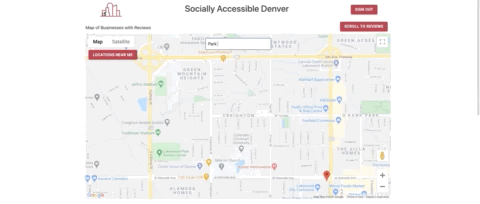

# Socially Accessible Denver (Back End) 
Socially Accessible Denver is a full-stack web application designed for users with disabilities to post and read reviews of restaurants, bars, and other social locations in Denver. I was inspired to create this application from my time working in adaptive cycling. After spending all day out riding, the groups I worked with would want a place to go out and enjoy a meal together. Finding a restaurant or bar that could accommodate multiple individuals with disabilities proved to be challenging. This application would help with this by giving a place for individuals with disabilities to share their experiences. 
[View Front End Repo](https://github.com/JAGrenier/Socially-Accessible-Denver-Front-End)

## Technologies 
**Front End:** React.js and Material Ui

**Back End:** Node.js with Express, PostgreSQl

**API:** Google Places API, and Google Maps Javascript API.

## Features
### Auth 

 
The application first directs users to a sign in page. This page was designed using Material Ui and the aut is set up with Firebase Authentication. Signing out will direct users back to the sign in page, and there is a link on the sign in page directing to a form to sign in as a new user.  

### Embedded Map 

  
The Map has a zoom to my location feature as an autocomplete search box. The search box will zoom to the location selected and only returns results in the Denver area. The map is created using the Google Javascript Maps API and the autocomplete is using the Google Places API. 
### User Reviews 
 
 
Once Logged in Users can view all locations with reviews, view reviews for a specific location, create a new review with an image.  

## Challenges
With the target audience of this application, accessibility was an important goal. I faced some challenges with implementing an embedded map and meeting accessibility standards. To help me with this, I used the WAVE accessibility evaluation tool throughout the process. This tool helped me make smart choices about contrast, forms, and buttons. 

Previous to this project I had not used Node.js or PostgreSQL. I was able to reference documentation through out the project to succesfully implement my back end. 

## Future Implementation
* An admin login to allow for deleting and updating reviews as needed and track traffic 
* Further accessibility testing including manual checking using screen readers 
* User profile page where they can favorite a location and track the reviews they have posted 

## Demo Video 
[Demo Video with Audio](https://www.youtube.com/watch?v=81MHBvVuVqE&t=2s) 

[Demo Video without Audio](https://www.youtube.com/watch?v=NZ8C9ButCNU&t=1s)

## Contact 
You can find me on [LinkedIn](https://www.linkedin.com/in/jagrenier/)
